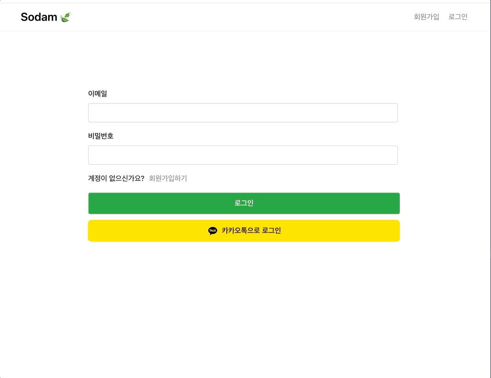
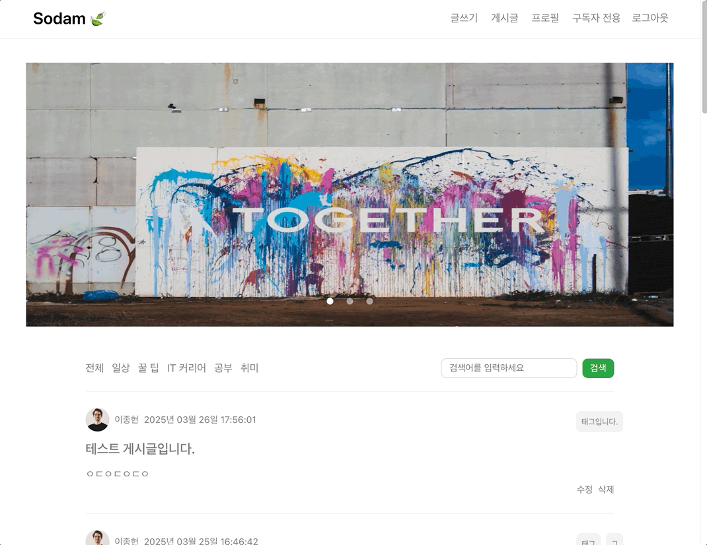

# Sodam 🍃

> - 우리들의 성장 이야기 Sodam 🍃
> - 현재 개발 전략 : TDD 활용하지 않고 엔드포인트 기능 구현에 초점을 맞춤
>   - 1. 제한적인 기간 : 해당 프로젝트는 4월 초에 마무리할 예정이므로 기간이 제한적임 
>   - 2. 개인의 역량 : 프론트엔드 & 백엔드 모두 혼자서 구현해야함
>   - 3. 변경되는 애플리케이션 비즈니스 및 정책 : 개발 과정에서 비즈니스가 변경되는 경우가 있음
>  
> - 배포 및 운영 할 때 운영하면서 단위 테스트 및 통합 테스트 작성함으로써 코드의 신뢰성을 확보할 예정

### 1차 개발 기능 임시 시연(추후에 재업데이트할 예정, 틀만 잡아보기)

| 기능 | 설명 | 시연 GIF |
|------|------|---------|
| **카카오 Oauth2 로그인 처리** | 카카오 계정을 이용한 OAuth2 로그인 |  |
| **게시글 조회** | 카테고리, 태그, 제목, 작성자, 페이징을 통한 조회 | .gif)   .gif) |
| **게시글 상세 조회** | 선택한 게시글의 상세 정보 조회 | .gif) |
| **게시글 좋아요/싫어요 처리** | 중복 클릭 시 좋아요/싫어요 취소 가능 | .gif) |
| **댓글 등록** | 게시글에 댓글 작성 기능 | .gif) |
| **댓글 좋아요/싫어요 처리** | 중복 클릭 시 좋아요/싫어요 취소 가능 | .gif) |
| **프로필 페이지** | 사용자 프로필 정보 확인 |  |
| **구독자 전용 서비스** | 구독자만 열람 가능한 게시글 제공 | .gif) |

