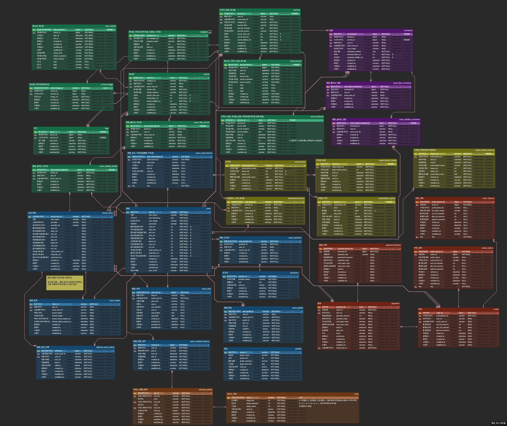
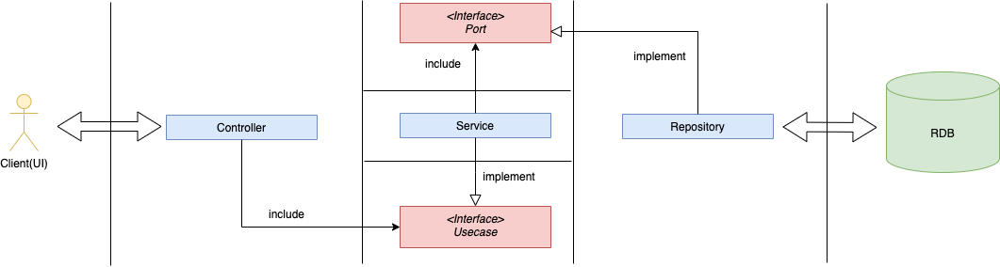
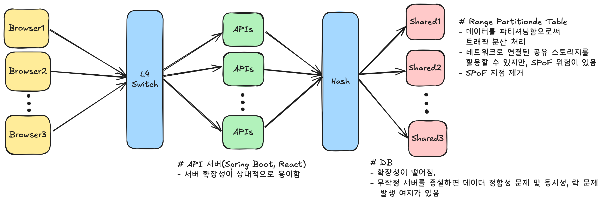
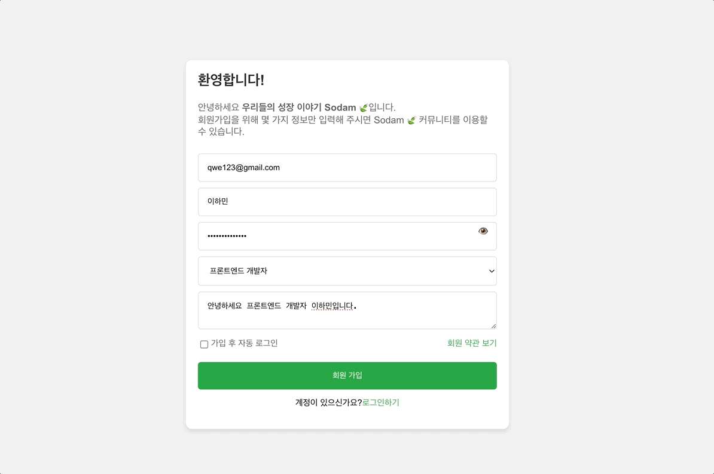
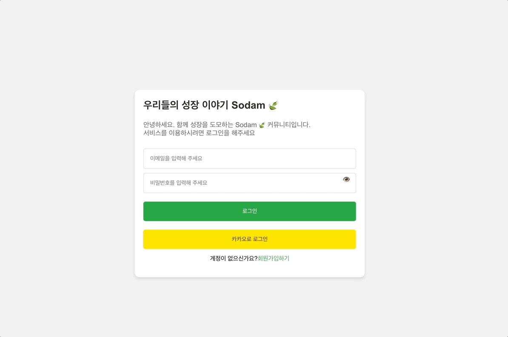
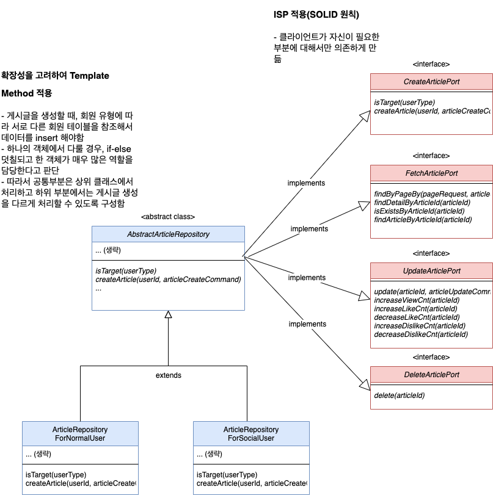
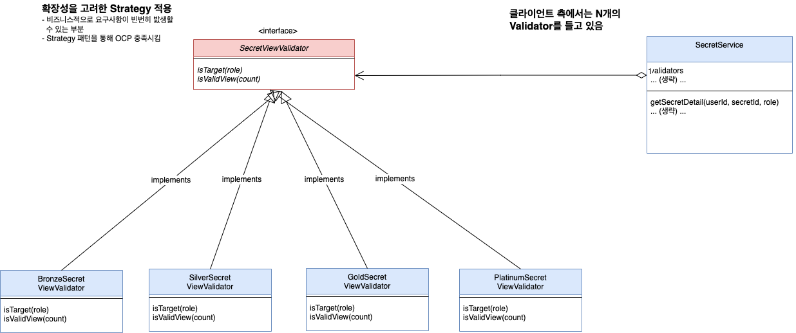

# Sodam 🍃


> - 우리들의 성장 이야기 Sodam 🍃
> - <strong>목표 : 스스로 실제 서비스 수준의 퀄리티로 프로젝트 구현하기, 또한, 실제 운영하기(목표 사용자수 : 50, 기간 : 3개월)</strong>
> - 현재 개발 전략 : <strong>TDD 활용하지 않고 엔드포인트 기능 구현에 초점을 맞춤</strong>
>   - 제한적인 기간
>   - 개인의 역량 : 프론트엔드 & 백엔드 모두 혼자서 구현해야함
>   - 변경되는 애플리케이션 비즈니스 및 정책 : 개발 과정에서 비즈니스가 변경되는 경우가 있음
>  
> - 배포 및 운영 할 때 운영하면서 단위 테스트 및 통합 테스트 작성하며 리팩토링함으로써 깔끔한 코드 베이스 유지와 신뢰성을 확보할 예정

<br>
<br>


## 🏛️ 프로젝트 설계 

> - ### 1. ERD 설계 
>   
>   - 기본적으로 **정규화 중시(OLTP)**, 핵심 엔티티 정의 및 필요시 파생 엔티티 구성(필요 이상으로 생성 x)
>   - 단, 베스트 게시글과 같이 **대용량의 데이터(OLAP)를 다룰 때는 트랜잭션 처리보단 성능을 중시하여 정규화 일부 포기** 
>   - 가격, 상태, 등급, ... **선분 이력**으로 관리함. 특히 **가격의 경우 1년 단위로 데이터 등록하여 시기별로 할인율이 다르게 적용되게 구성함** 
>   - **정책은 여러가지 조건(규칙)의 조합**이라는 아이디어를 착안하여 **확장성 있는 정책 테이블 정의(제제 정책, 쿠폰 발급 정책)**
>   - (현재 개발 생산성을 위해 단순 참조로 구성, 추후에 복합 pk 및 인덱스 설정을 통해 성능 개선시킬 예정) 

<br>

> - ### 2. 백엔드 프로젝트 아키텍처
>   
>   - 해당 프로젝트 구조의 최종 목표는 **외부 환경 변동으로부터 비즈니스 로직을 안전하고 견고하게 구성시키는 것**
>   - **OCP, ISP, DIP** 중시
>   - 처음에는 개발 생산성을 위해 전통적인 **계층형 아키텍처**로 구상했으나, 리팩토링 시점에서는 **도메인 중심 아키텍처**과 유사한 형태로 변경(둘을 조합하여 구성함)
>   - 아마... 헥사고날로 바꿀듯 ㅠㅡ(spring MVC, spring Webflux 사용이슈...)
>   - ```
>       domain: 특정 도메인
>       ├── controller: 사용자 요청 흐름 관장
>       │   ├── request: 요청 dto
>       │   ├── response: 응답 dto
>       ├── service: 비즈니스 로직, 업무 프로세스 처리
>       │   ├── usecase: 클라이언트(Controller, ...)가 호출할 수 있는 인터페이스 모음
>       │   ├── port: 외부(RDB, ...)와의 통신을 위한 인터페이스 모음
>       │   ├── command: 작업 처리용 dto
>       ├── model: 도메인 오브젝트
>       ├── exception: 도메인에서 발생할 수 있는 예외 모음
>       ├── repository: DB 접근 및 작업 처리
>       ├── entity: RDB 테이블 매핑

<br>

> - ### 3. 백엔드 & 인프라 아키텍처
>   
>   - SPoF 제거, 기본적으로 <strong>Active-Standby 이중화 구성</strong>
>   - 추후에 서비스가 커진다고 가정했을 때 API 서버의 경우 증설이 상대적으로 용이하지만, 확장성이 떨어지는 DB의 경우 트래픽이 몰려서  부하가 발생할 수 있기 때문에 이 부분은 <strong>Range Partitioned Table을 활용할 예정(테이블 수평 분할을 통한 분산 처리)</strong>

<br>

> - ### 4. 프론트엔드 
>   - 자주 사용되는 html 엘리먼트를 재사용성, 상태관리, 스타일링 및 확장성을 고려하여 컴포넌트 정의해서 재활용  


<br>


## 📌 1차 개발 범위 및 목표 : 단순한 형태의 커뮤니티 사이트 구축

| 기능 | 설명 |
|------------------|------------------------------|
| 🔹 **회원 (User)** | - 사용자 회원가입 및 로그인 <br> - JWT 기반 인증 및 보안 <br> - 소셜 로그인 지원 (Kakao) |
| 🔹 **게시글 (Article)** | - 게시글 작성, 수정, 삭제 <br> - 좋아요 및 조회수 관리 <br> - 태그 및 카테고리 지정 가능 |
| 🔹 **댓글 (Comment)** | - 게시글에 대한 댓글 작성, 수정, 삭제 <br>  - 댓글 좋아요/싫어요 기능 |
| 🔹 **카테고리 (Category)** | - 게시글 분류를 위한 다중 카테고리 지원 <br> - 카테고리별 조회 기능 |
| 🔹 **시크릿 게시글 (Secret Article)** | - 구독자 전용 게시글 제공 <br> - 비구독자는 요약본만 확인 가능 <br> - 구독 여부에 따라 접근 권한 부여 |
| 🔹 **구독권 서비스 (Subscription)** | - 유료 구독을 통한 추가 혜택 제공 <br> - 구독 기간 및 결제 내역 관리 <br> - 구독자 전용 콘텐츠 및 커뮤니티 접근 가능 |
| 🔹 **회원 프로필 (Profile)** | - 회원 정보 요약(기본 회원 정보, 회원 등급, 보유 구독권, 작성한 게시글, 현재 순위) <br> - 자신이 작성한 게시글 조회 <br> - 자신이 좋아요를 클릭한 게시글 조회 |

<br>
<br>

## 📌 1차 개발 기능 시연 

| 기능 | 설명 | 시연 GIF |
|------|------|---------|
| **회원가입** | 사용자 회원가입 처리 |  |
| **카카오 Oauth2 로그인 처리** | 카카오 계정을 이용한 OAuth2 로그인 |  |
| **게시글 조회** | 카테고리, 태그, 제목, 작성자, 페이징을 통한 조회 | .gif) <br> .gif) |
| **게시글 상세 조회** | 선택한 게시글의 상세 정보 조회 | .gif) |
| **게시글 좋아요/싫어요 처리** | 중복 클릭 시 좋아요/싫어요 취소 가능 | .gif) |
| **댓글 등록** | 게시글에 댓글 작성 기능 | .gif) |
| **댓글 좋아요/싫어요 처리** | 중복 클릭 시 좋아요/싫어요 취소 가능 | .gif) |
| **프로필 페이지** | 사용자 프로필 정보 확인 | .gif) |
| **구독자 전용 서비스** | 구독자만 열람 가능한 게시글 제공 | .gif) |

<br>


## 📌 2차 개발 범위 및 목표 : 구독권 결제 기능 및 시크릿 부분 구현 


<br>

## 📌 2차 개발 기능 시연 


<br>

## 📌 3차 개발 범위 및 목표 : 실제 서비스 배포 및 운영 


<br>

## 📌 결과 

<br>

## 📌 기술적 고민 
> - ### 1. Code-Level Scalability 고려 - 과연 내 코드는 새로운 요구 사항 발생시 확장성이 용이할까? 
>   - ### (1) Template Method
>   - 
>   - 비즈니스 상에서 새로운 유형의 회원이 등장할 경우를 고려함
>   - <strong>Template Method 패턴을 통해 새로운 유형의 회원이 등장하더라도 확장성이 용이한 코드 구조 형성</strong>
>   - ### (2) Strategy 
>   - 
>   - 비즈니스 상에서 새로운 형태의 구독권을 정의하고 사용할 경우를 고려함
>   - <strong>Strategy 패턴을 통해 새로운 형태의 구독권이 등장하거나 기존의 구독권이 삭제되어도 확장성이 용이한 코드 구조 형성</strong>
> - ### 2. 불필요한 주석 제거 밒 가독성 높고 깔끔한 코드 베이스 관리
> ```Kotlin
> // 1. 회원가입 로직 - [일반회원]
>  @Transactional(
>        propagation = Propagation.REQUIRED,
>        rollbackFor = [Exception::class]
>    )
>    override fun registerNormalUser(userSignupCommand: UserSignupCommand): UserSignupResponse {
>         // 회원등록 작업 전 유효성 검증
>         checkDuplicatedEmail(userSignupCommand.email)
>         checkExistsPosition(userSignupCommand.positionId)
>         checkExistsSubscription(SubscriptionsType.FREE.name)
>         checkExistsGrade(GradesType.ENTRY.name)
> 
>         // 회원유형에 맞는 포트 조회 - 일반회원
>         val userPositionCreatePort = getCreateUserPositionPortByUserType(UserType.NORMAL)
>         val userSubscriptionCreatePort = getCreateUserSubscriptionPort(UserType.NORMAL)
>         val userGraderCreatePort = getCreateUserGradePort(UserType.NORMAL)
> 
>         // 회원등록 처리 비즈니스 로직
>        val sodamUser = createNormalUserPort.createUser(userSignupCommand)
>        userPositionCreatePort.createByPositionId(userId = sodamUser.userId, positionId = > userSignupCommand.positionId)
>         userSubscriptionCreatePort.createSubscription(userId = sodamUser.userId,  subscriptionType = SubscriptionsType.FREE)
>         userGraderCreatePort.createGrade(userId = sodamUser.userId, gradeType = GradesType.ENTRY)
>        return sodamUser.toSignupResponse()
>    }
>
> // 2. 구독권 검증 처리 후 구독자 전용 게시글 상세 조회 처리 로직
>
>    @Transactional(
>        propagation = Propagation.REQUIRED,
>        rollbackFor = [Exception::class]
>    )
>    fun getSecretDetail(userId: String, secretId: Long, role: String): SecretDetailResponse {
>        val totalViewCnt = secretViewRepository.countViewToday(userId = userId) // 보유 구독권 서비스에서 현재 회원의 당일 조회수 확인
>        val isViewable = viewValidators.stream()
>            .filter { it.isTarget(role) } // 현재 발급된 구독권
>            .findFirst()
>            .orElseThrow()
>            .isValidView(totalViewCnt) // 조회 가능 여부 확인
>
>        if ( ! isViewable )
>            throw SecretException.InvalidSecretViewException()
>
>
>        secretRepository.increaseViewCnt(secretId) // 조회수 증가
>        secretViewRepository.create(userId = userId, secretId = secretId) // 시청 이력 생성
>        return secretRepository.findDetailBySecretId(secretId = secretId)
>                               .toResponse()
>    }
>
> ```
> - ### 3. Server-Level에서의 확장성(SPoF 지점 제거)
> - ### 4. 적은 자원(스레드)로 효율적인 작업 도모(Kotlin Coroutine, SpringWebFlux)
> - ### 5. 프로젝트 배포 전략(Rolling-Deployments)
> - ### 5. 프로젝트 운영 전략()
> - ### 6. 성능 개선 과정(인덱싱 설정 및 Redis, Kafka 활용)
> - ### 7. Spring MVC, Spring WebFlux 동시에 사용 -> 결국엔 모듈 단위로 분리해서 사용 


## 📝 프로젝트 회고 
> - 좋은 아키텍처란 무엇인가? 확장성이란 무엇인가?에 대해 명확하게 얘기할 수 있을 것 같다.
> - (부연 설명)
> - 문서 작업과 정확한 목적의식을 갖고 코딩하는 것의 중요성  
> - (부연 설명)
> - 완벽한 개발 과정은 없고 현재 나의 개발 환경에 맞춰서 유도리있게 적응해나가야 한다. 
> - (부연 설명)
> - CS의 중요성
> - (멀티 코어, 멀티 스레드 환경, 스레드 딜레마)
> - 협업의 중요성(프론트엔드, 백엔드, 디자이너, 그리고 이해관계자들)
> - (부연 설명)