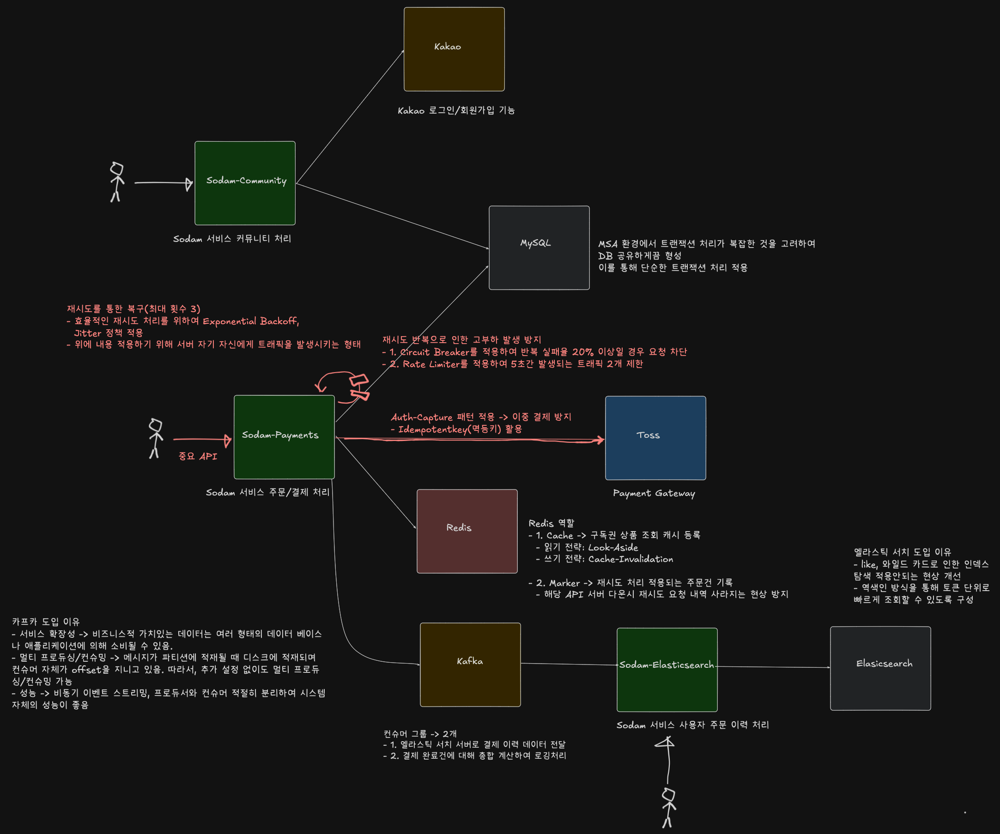

# 우리들의 성장 이야기 Sodam 🍃
**청년 쉬었음 인구 50만명 이상 취업이 길어지는 시대, 함께 준비하고 성장하는 커뮤니티가 필요합니다.**

현재 산업 분야를 막론하고 청년들의 취업 준비 기간이 늘어가고 있습니다. 이제는 혼자가 아니라, 함께 준비하며 성장할 수 있는 공간이 필요합니다.

**Sodam🍃은 구독권 서비스 기반으로 전문가와 동료들과 함께 성정하며 취업을 효율적으로 준비하는 플랫폼입니다.** 

취준생들에게 보다 체계적이고 효과적으로 준비할 수 있도록 다음과 같은 **3가지 주요 기능을 제공**합니다

1. **구독권으로 인증된 전문가의 교육 콘텐츠 이용**
    - 실력 있는 전문가들이 제공하는 강의와 자료를 구독권을 통해 쉽게 구매하고 학습할 수 있습니다.
2. **팀 프로젝트 모집 및 스케줄 관리 기능 제공**
    - 함께 성장할 팀원을 찾고, 일정 관리를 통해 효율적인 협업이 가능합니다.
3. **지식과 경험을 나누는 커뮤니티 공간**
    - 질문, 정보, 후기 등 다양한 지식을 자유롭게 공유하며 함께 성장합니다.

 
 

## 🏛️ 프로젝트 설계 

### 1. ERD 설계 
>   
> - 기본적으로 중복 데이터로 인한 데이터 이상현상을 최소화하기 위해 정규화를 중시하여 테이블을 정의했습니다.
> - 하지만, 성능이 더 중요시 여겨지는 경우에는 일정부분 반정규화를 허용했습니다.
> - 단순히 화면에서 비춰지는 데이터만 관리하는 것이 아니라 운영시점에서 발생하는 다양한 데이터를 관리하려고 설계했습니다.
>     1. 구독권 상품 가격
>         - 선분 이력으로 관리 했습니다.
>         - 1년을 기점으로 4분기에 걸쳐서 서로 다른 할인율이 적용 되게끔 구성했습니다.        
>    2. 서비스 정책
>        - 서비스 정책은 여러 개의 조건의 조합이라는 생각을 기반으로 설계 했습니다.
>        - 그래서, 여러 개의 조건을 활용해서 다양한 정책을 정의할 수 있게끔 구현 했습니다.
>        - 예를 들어서, 서비스 정책은 3개의 조건으로 구성되며 각각 특정 연산자를 기반으로 동적으로 정책을 사용할 수 있게끔 형성 했습니다.
>         - 그래서 서비스 정책 테이블에서는 3개의 Foreign Key와 2개의 연산자로 데이터가 저장되게 설계했습니다.

 

### 2. 백엔드 아키텍처 설계
>   
> - **기본적으로 SOLID 원칙을 중시하고 헥사고날 아키텍처를 학습하며 저의 프로젝트 구조에 알맞는 아키텍처를 구성하려고 노력했습니다.**
> - 초기에는 전통적인 3계층 아키텍처로 빠르게 구현했습니다.
> - 하지만, **개발 규모가 어느정도 나오고 내가 기획한 비즈니스 프로세스가 명확해 질 때 쯤 SOLID 원칙과 헥사고날 아키텍처를 고려하여 리팩토링 했습니다.**
> - **서비스 레이어를 중심으로 양 사이드에 유스케이스와 포트라는 인터페이스를 정의하여 추상계층을 형성하였고 리포지토리 계층의 클래스는 포트 인터페이스를 구현하도록 구성하고 컨트롤러 계층은 유스케이스 인터페이스에 의존하도록 구성함**
>    1. **SRP: 기본적으로 오브젝트가 하나의 역할에 충실하도록 구현했습니다.** 
>    2. **OCP: Template Method 패턴과 Strategy 패턴을 적용하여 코드 레벨에서의 확장성을 확보하려고 노력했습니다.** 
>        - **Template Method → 서로 다른 유형의 회원 부분 처리**
>        - **Strategy → 구독권 서비스**
>    3. **LSP: 부모 클래스(인터페이스)를 사용하는 모든 곳에 자식 클래스 인스턴스를 넣어도 제대로 동작하게끔 구성하였습니다.** 
>    4. **ISP: 하나의 큰 인터페이스를 정의하기 보다는 해당 인터페이스를 잘게 쪼개서 클라이언트가 정말로 필요한 부분에 대해서만 의존하도록 구성하도록 설정했습니다.**
>        - **클라이언트가 사용하는 기능 단위로 인터페이스를 추출하여 활용할 수 있게끔 구성**
>    5. **DIP: 하위 모듈은 상위 모듈에 의존하되 상위 모듈은 하위 모듈에 의존하면 안되는 것을 중시하여 서비스 레이어에서 유스케이스와 포트 인터페이스를 관리하도록 구성했습니디.**
>        - **서비스 레이어에 포트, 유스케이스 인터페이스를 배치하여 구성**
> - **이렇게 설계를 함으로써 서비스 오브젝트에는 추상화 레벨을 높여서 가독성이 높고 변경에 유연하게 대처할 수 있도록 구성함. 또한, 외부 변동으로부터 견고한 코드를 작성함**

 
 

### 3. 시스템 아키텍처 설계
>   
> - **현재 클라우드 관련 공부와 시스템 아키텍처를 공부하며 서비스 초기 설계 과정 중에 있습니다.** 
> - MSA를 도입하게 된 계기는 크게 세가지 이유가 있습니다. 
>   - 1. 대용량 트래픽 분산 처리 
>   - 2. 시장 변화에 맞춰 독립적으로 운영/개발/배포가 가능한 방식 적용 
>   - 3. Sodam-Community와 Sodam-Payments의 서버 스펙이 다름(Tomcat, Netty) 
> - 하지만, 현재 초기 설계 내용을 보면 DB가 공유되고 있는 형태입니다. 이 부분을 의아하게 생각하실 것 같습니다. 
> - 제가 해당 부분을 위와 같이 구성한 이유는 MSA를 적용하게 될 경우 어려운 것 중에 하나는 트랜잭션 처리라고 생각합니다. 따라서, 초기에는 트랜잭션을 단순하게 처리하고자 모든 모듈이 DB를 공유하다가 추후에 모듈 자체에서 DB를 갖는 형태로 변경할 계획입니다.
> - 또한, 시스템 아키텍처를 설계하며 중요시 여긴 부분은 2가지임. 
>   - 1. 시스템 고가용성
>   - 2. 트래픽 분산 
> - 기본적으로 서버 장비를 이중화하여 복구와 자동 페일오버를 적용함으로써 고가용성을 확보할 생각임
> - 또한, RDB의 경우 Master DB와 Slave DB를 구성할 계획이고 write/read 작업은 Master DB에서 처리하고 Slave DB도 주기적으로 replication을 진행하여 추후에는 read 작업을 처리하여 read 부하를 분산시킬 계획임
> - 또한, 현재 구현된 내용을 보면 Redis, Elastisearch, Kafka등은 모두 SPoF 지점으로 시스템의 안정성이 취약한 상황임 만약 비용적으로 여유가 있다면 이 부분도 해당 기술에서 지원하는 자동 페일오버와 복제 기능을 활용하여 고가용성을 확보할 계획
>    - Redis의 경우, 기본적으로 3개의 서버를 띄우고 Sentinel을 활용하여 자동 페일오버와 복제를 처리할 계획임
>     - Elasticsearch의 경우, 현재 단일 노드에서 구동되기 때문에 이 부분도 SPoF인데, 다시 클러스터를 정의하고 최소 3개의 노드를 구동시킨 다음 각 노드별로 Primary 인덱스를 고르게 분포시킨 다음 shard된 인덱스를 서로 다른 노드에 배치할 생각임. 이를 통해 시스템의 안정성과 부하 분산 처리를 적용할 계획임

 
 

## 🌱 문제 해결 과정을 통한 성장 

### 📝 문제 해결 리스트 
> - 0. 비즈니스 로직에 산재되어 있는 암호화 처리 로직을 AOP와 애너테이션을 활용하여 분리
> - 1. Spring MVC의 성능 한계를 Kotlin Coroutine & Spring WebFlux 를 적용하여 성능 개선
> - 2. MSA 환경에서 서비스 간 호출 실패가 전체 시스템 성능과 장애로 이어지는 문제를 Exponential Backoff, Jitter, Circuit Breaker, Rate Limiter로 해결
> - 3. 여러 유형의 회원 테이블 정의에 따른 확장하기 어려운 구조를 Template Method와 추상화를 활용하여 개선
> - 4. 비즈니스 요구사항이 자주 변동되는 구독권 서비스를 Strategy 패턴 적용
> - 5. 무거운 쿼리(조인 2개 이상 및 Computed Column 계산을 위한 RDB 엔진 사용)를 Redis로 캐싱 매커니즘을 구현하여 성능 개선
> - 6. 카카오톡 소셜 로그인 기능 OAuth2.0 활용하여 구현
> - 7. 비효율적인 결제 이력 조회 및 저장하는 구조를 Elasticsearch와 Kafka를 활용하여 개선
> - 8. 빈 스코프에서 관리되지 않는 오브젝트에 DI 기능 적용
> - 9. Spring WebFlux 환경에서 Event Loop에 의해 스레드 전환시 MDC에 설정한 정보 유실 방지 
> - 10. 사용자 접근 이력을 Spring Security 필터 체인 내에서 동작하는 Spring 필터를 활용하여 사용자 접속 이력을 저장
> - 11. 효율적인 시스템 칼럼 생성을 위한 @EnableJpaAuditing 시스템 구축
> - 12. 서비스 오브젝트 내에서 @Transactional이 붙은 메서드를 호출할 때 Transaction이 적용되지 않는 문제를 우회해서 호출되도록 구성하여 해결

 
 

### 0. 비즈니스 로직에 산재되어 있는 암호화 처리 로직을 AOP와 애너테이션을 활용하여 분리
> - 현재 문제는 **회원 서비스 오브젝트에 비즈니스 로직과 암호화 로직이 혼재**되어 있습니다.
> - 또한, 해당 기술 로직은 여러 부분에 나타나고 있습니다.
> - 이는 서비스 오브젝트에 작성된 비즈니스 로직에 대한 가독성을 저해시킬 뿐만 아니라, 변경에도 유연하게 대처할 수 없습니다.
> - **이 문제를 해결하고자 AOP와 애너테이션을 활용하여 비즈니스 로직과 기술적 로직을 분리했습니다.**

 

### 1. Spring MVC의 성능 한계를 Kotlin Coroutine & Spring WebFlux 를 적용하여 성능 개선
> - 현재 문제는 **회원 서비스 오브젝트에 비즈니스 로직과 암호화 로직이 혼재**되어 있습니다.
> - 또한, 해당 기술 로직은 여러 부분에 나타나고 있습니다.
> - 이는 서비스 오브젝트에 작성된 비즈니스 로직에 대한 가독성을 저해시킬 뿐만 아니라, 변경에도 유연하게 대처할 수 없습니다.
> - **이 문제를 해결하고자 AOP와 애너테이션을 활용하여 비즈니스 로직과 기술적 로직을 분리했습니다.**

 

### 2. MSA 환경에서 서비스 간 호출 실패가 전체 시스템 성능과 장애로 이어지는 문제를 Exponential Backoff, Jitter, Circuit Breaker, Rate Limiter로 해결
> - 현재 해당 서비스는 여러 외부 API와 연동되고 있습니다. 예를 들어서, Kakao와 Toss 서비스가 있습니다.
> - **외부로 부터 연동된 서비스에서 장애가 발생할 경우, 해당 서비스의 성능 저하와 장애 발생 원인으로 이어진다는 것을 알게 되었습니다.**
> - **이를 적절하게 대처하기 위하여, 중요한 API는 재시도를 통해 복구 처리를 적용하고 반복적으로 실패할 경우 Circuit Breaker 통해 요청 전송을 차단했습니다.**
> - **이를 통해서, 전체 서비스의 안정성과 성능을 개선시킬 수 있었습니다.**

 

### 3. 여러 유형의 회원 테이블 정의에 따른 확장하기 어려운 구조를 Template Method와 추상화를 활용하여 개선
> - 현재 프로젝트에서는 **여러 유형의 회원이 정의되어 있습니다. 또한, 이를 하나의 테이블로 관리하는 것이 아니라 각각 서로 다른 테이블로 정의해서 관리하고 있습니다.**
> - 개발 초기 과정에서 회원 서비스 오브젝트에서 특정 유형의 회원으로 회원가입하는 기능을 메서드 단위로 일일이 작성하였습니다. 이는 각 회원마다 가입 프로세스가 달랐기 때문입니다.
> - 또한, 특정 유형의 회원이 게시글을 작성할 때 해당 기능을 하나의 메서드에 담아서 처리하게 만들었습니다.
> - **이로 인해 해당 코드들은 확장하기 어려운 구조가 되었습니다. 즉, 새로운 유형의 회원이 정의될 때 마다 새롭게 메서드를 정의해야 하거나 내부적으로 분기문을 많이 사용하는 코드가 작성되었습니다.**
> - **이 문제를 개선하고자 해당 서비스 오브젝트의 추상화 레벨을 높여서 가독성과 확장성이 좋은 코드를 작성했습니다. 이 과정에서 사용한 디자인 패턴이 Template Method 패턴입니다. 또한, 추상 프로그래밍을 적극 활용했습니다.**
> - **따라서, 가독성이 좋고 앞으로 발생할 수 있는 변경에 대해 유연하게 대처 가능한 확장성이 용이한 코드 구조를 설계했습니다.**

 

### 4. 비즈니스 요구사항이 자주 변동되는 구독권 서비스를 Strategy 패턴 적용
> - **현재 프로젝트는 구독권 서비스를 운영하고 있습니다**. 각 구독권 혜택 내용 아래와 같습니다.
>     1. BROZE: 가격은 5000원이고 한달간 적용됩니다. 또한, 전문가들의 콘텐츠를 하루 기준 15번 조회, 15번 다운로드 받을 수 있습니다. 
>     2. SILVER: 가격은 7000원이고 한달간 적용됩니다. 또한, 전문가들의 콘텐츠를 하루 기준 30번 조회, 30번 다운로드 받을 수 있습니다. 
>     3. GOLD: 가격은 15000원이고 한달간 적용됩니다. 또한, 전문가들의 콘텐츠를 하루 기준 50번 조회, 50 다운로드 받을 수 있습니다. 
>     4. PLATINUM: 가격은 20000원이고 한달간 적용됩니다. 또한, 전문가들의 콘텐츠를 하루 기준 100번 조회, 100다운로드 받을 수 있습니다. 
> - 애플리케이션 운영 시점에서 해당 부분은 비즈니스 영역입니다. 즉, **해당 비즈니스는 애플리케이션을 운영하는 과정에서 시간이 지남에 따라 변경된다고 생각합니다.**(시장의 니즈, 회사 마케팅 전략에 맞춰 변경)
> - **하지만, 단순하게 분기문으로 작성하여 구독권 서비스를 처리하는 방식은 매우 비효율적입니다.(비즈니스의 새로운 요구사항이 추가되거나 기존의 요구사항이 제거될 때마다 코드를 수정 해야합니다)**
> - **따라서, 이런 요구사항에 적절히 수용할 수 있게 구성하고자 Strategy 패턴을 적용하였습니다.**

 

### 5. 무거운 쿼리(조인 2개 이상 및 Computed Column 계산을 위한 RDB 엔진 사용)를 Redis로 캐싱 매커니즘을 구현하여 성능 개선
> - 서비스 운영 시점에서 간혹 무거운 쿼리들이 있습니다.
> - **해당 서비스에서는 구독권 상품의 판매 정보를 조회하는 쿼리**가 무거운 쿼리입니다.
> - **사용자가 특정 구독권 상품을 조회할 때 마다 RDB에 매번 질의하게 되면 부하가 발생하며 시스템 성능이 저하된다고 생각합니다.**
> - **또한, 구독권 상품 특성상 자주 변경되는 데이터가 아니기 때문에 캐시에 올려두어서 사용하기 적합하다고 판단했습니다.**
> - **이런 점을 고려하여 Redis를 통해 Cache 매커니즘을 활용하여 조회 성능을 개선시키고 RDB의 부하를 줄일수 있었습니다.**

 

### 6. 카카오톡 소셜 로그인 기능 OAuth2.0 활용하여 구현
> - 해당 서비스에서 **소셜 로그인 기능**이 있습니다.
> - 소셜 로그인 기능을 구현하는데 여러가지 방식이 있습니다.
> - 예를 들어서, 카카오 서버에 있는 리소스를 현재 서비스 RDB에 저장해 놓고 관리한 다음, 소셜 로그인할 때 활용하는 방식입니다.
> - **하지만, 해당 방식은 보안 상의 문제가 있습니다. 따라서, 보안 상의 문제점을 고려하여 OAuth2.0 프레임워크를 활용하여 소셜 로그인 기능을 구현했습니다.**

 

### 7. 비효율적인 결제 이력 조회 및 저장하는 구조를 Elasticsearch와 Kafka를 활용하여 개선
> - 해당 서비스에서 결제 이력을 조회해서 활용할 수 있습니다.
> - 하지만, 결제 이력이 많이 쌓여 있다고 가정했을 때, 단순 조회 쿼리는 성능 문제로 이어질 수 있다고 판단했습니다.
> - 또한, 결제 이력의 경우 시장 분석 지표나 마케팅 수단으로서 다양한 응용 가치를 지니고 있기 때문에 다양한 데이터 베이스에 관리하는 것이 중요합니다.
> - **이러한 부분을 고려하여 결제 이력 조회 성능을 개선하기 위해 Elasticsearch와 데이터의 일괄 처리 및 비동기 메시징 처리 등을 고려하여 Kafka을 적용하여 해결했습니다.**

 

### 8. 빈 스코프에서 관리되지 않는 오브젝트에 DI 기능 적용
> - 빈 스코프란 스프링 컨테이너가 빈을 생성하고, 보관하고, 공유하는 범위를 정의하는 부분입니다.
> - 빈 스코프 영역 내에서 스프링 컨테이너를 통해 빈들을 대상으로 DI를 적용할 수 있습니다.
> - 대표적으로, @Autowired 를 사용하면 컨테이너에 등록된 오브젝트 중에 주입하고자 하는 타입과 일치하는 오브젝트를 주입합니다.
> - **하지만, 빈 스코프에서 관리하지 않는 오브젝트에 경우 DI를 활용할 수 없습니다.**
> - **따라서, 직접적으로 오브젝트를 주입받는 방식이 아닌 companion object(static)키워드를 활용하여 우회해서 주입받는 방식으로 구현해서 해결했습니다.**

 

### 9. Spring WebFlux 환경에서 Event Loop에 의해 스레드 전환시 MDC에 설정한 정보 유실 방지
> - Spring WebFlux는 Netty 기반의 논블로킹 I/O 구조를 사용합니다.
> - Request와 Thread는 N:1 관계로, 하나의 요청이 여러 스레드에서 처리될 수 있습니다.
> - **Netty의 Event Loop 에 의해 요청 처리 중 스레드가 전환되면, ThreadLocal 기반 MDC 에 설정한 값(txid)가 유실됩니다.**
> - **따라서, 이 문제를 해결하기 위해 코루틴 환경에서는 kotlinx-coroutines-slf4j 라이브러리와 리액터 환경에서는 Reactor Context Propagation 라이브러리를 활용하여 MDC에 설정한 값이 유지되도록 연동하여 해결했습니다.**

 

### 10. 사용자 접근 이력을 Spring Security 필터 체인 내에서 동작하는 Spring 필터를 활용하여 사용자 접속 이력을 저장
> - 이전 프로젝트에서도 사용자의 접속 이력을 기록하기 위하여 관련 테이블을 정의했고 시도했습니다.
> - 하지만, 컨트롤러에서 처리해야 하는지 서비스에서 처리해야 하는지 고민했었고 컨트롤러에서 처리하려고 했지만 되려 중복 코드가 많이 발생하게 되어 구현하지 못했습니다.
> - **SpringMVC 구조와 Spring Security에 대해 학습 하던 중  Spring Security 필터 체인 내에서 동작하는 Spring 필터를 활용하여 사용자 접속 이력을 저장할 수 있다는 것을 알게되었습니다.**
> - **이를 통해 중복된 코드를 제거하고 효율적으로 사용자 접속이력을 기록할 수 있었습니다.**

 

### 11. 효율적인 시스템 칼럼 생성을 위한 @EnableJpaAuditing 시스템 구축
> - 데이터가 생성되거나 수정될 때 마다 시스템 칼럼을 기록하여 누가 해당 작업을 했는지 기록해야 합니다.
> - 이전 프로젝트에서 이를 기록하고자 도메인 로직 내에서 직접 생성하도록 구성했습니다.
> - **하지만, 이는 좋지 않는 구조이고 이를 개선하고자 @EnableJpaAuditing 을 활용하여 인터셉터와 여러 구현체를 정의했고 효율적으로 시스템 칼럼을 생성할 수 있는 시스템을 구축했습니다.**

 

### 12. 서비스 오브젝트 내에서 @Transactional이 붙은 메서드를 호출할 때 Transaction이 적용되지 않는 문제를 우회해서 호출되도록 구성하여 해결
> - OrdersService내에서 @Transactional이 붙은 메서드를 호출했지만, Transaction 처리가 적용되지 않았습니다.
> - **이는 @Transactional의 경우 스프링 컨테이너를 거쳐야지만 Transaction 로직을 갖고 있는 프록시를 호출하고 해당 오브젝트를 호출하는 형식으로 진행되어 Transaction이 적용됩니다.**
> - **따라서, 이 문제를 해결하기 위해 OrdersService내에서 @Transactional이 붙은 메서드를 호출할 때 스프링 컨테이너를 거쳐서 프록시가 호출되도록 우회하도록 적용하여 Transaction이 적용되게 구성했습니다.**

## 📌 기능 시연 

| 기능 | 설명 | 시연 GIF |
|------|------|---------|
| **회원가입** | 사용자 회원가입 처리 |  |
| **카카오 Oauth2 로그인 처리** | 카카오 계정을 이용한 OAuth2 로그인 |  |
| **게시글 조회** | 카테고리, 태그, 제목, 작성자, 페이징을 통한 조회 | .gif)   .gif) |
| **게시글 상세 조회** | 선택한 게시글의 상세 정보 조회 | .gif) |
| **게시글 좋아요/싫어요 처리** | 중복 클릭 시 좋아요/싫어요 취소 가능 | .gif) |
| **댓글 등록** | 게시글에 댓글 작성 기능 | .gif) |
| **댓글 좋아요/싫어요 처리** | 중복 클릭 시 좋아요/싫어요 취소 가능 | .gif) |
| **프로필 페이지** | 사용자 프로필 정보 확인 | .gif) |
| **구독자 전용 서비스** | 구독자만 열람 가능한 게시글 제공 | .gif) |

 

## 📝 프로젝트 회고 
> - 1. 기술을 도입할 땐 합리적인 근거가 필요하다
>   - 해당 프로젝트의 경우 개인 프로젝트이기 때문에 특정 기술을 도입함에 있어서 학습의 목적으로 적용한 부분이 많습니다.
>   - 하지만, 팀 프로젝트로 진행하게 될 경우 그 기술을 제대로 이해하며 팀원을 설득하는 과정이 반드시 필요하기 때문에 합리적인 근거가 필요할 것이라고 생각합니다. 
> - 2. 시스템 확장성의 두가지 관점
>   - 확장성은 크게 2가지 관점으로 볼 수 있다고 생각합니다
>   - 첫 번째로는 코드 레벨에서의 확장성입니다. 이를 위해 OOP와 디자인 패턴을 제대로 이해하며 코드로 녹여낼 수 있어야 한다고 생각합니다.
>   - 그래서, 충분한 학습과 연습을 꾸준히 해야겠다고 생각되어 집니다.  
>   - 두 번재로는 서버 레벨에서의 확장성입니다. 서버마다 특성이 다릅니다.
>   - 예를 들어서, RDB는 데이터를 저장하고 관리하는 반면에 API 서버는 상태를 저장하지 않습니다.
>   - 이러한 특징은 해당 서버의 확장성과 직결된다고 생각합니다.
>   - 따라서 내가 시스템 아키텍처를 설계함에 있어서 해당 서버의 핵심과 특징을 고려하여 설계해야 한다고 생각합니다.
> - 3. CS의 중요성
>   - 결국에는 가장 기초가 되는 것은 CS 라고 생각합니다.
>   - 모든 프레임워크나 기술은 모두 CS를 바탕으로 두고 있기 때문에 더욱 깊이있는 이해를 하기 위해선 CS를 부단히 학습해야 하는 것 같습니다. 
