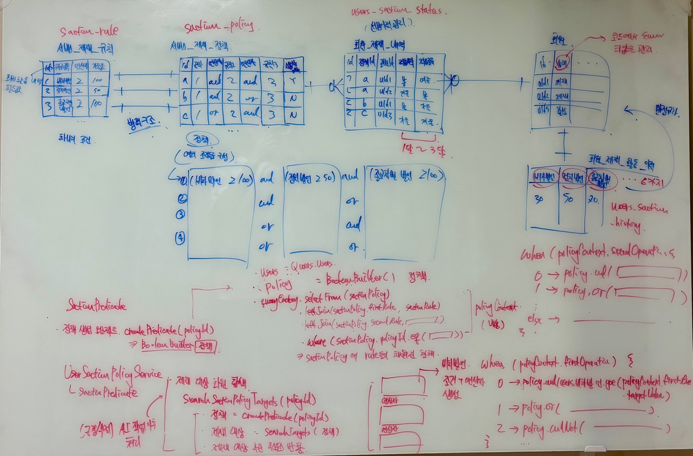

# ERD 설계 과정

 

### ERD 설계 전략 
### 1. 개발 속도를 고려한 단순한 형태 - 성능 보단 개발 생상선을 고려
> - 초기 서비스 구현시에는 단순한 형태로 구현하되 확장해 나가는 것이 효율적인 것 같다
> - 기존에 개인 프로젝트를 진행할 때마다 필요 이상으로 ERD 설계를 진행하여 개발 속도가 느리다는 문제를 많이 경험했다
> - 그래서, 1차 개발 과정에서는 핵심 엔티티에 파생 엔티티를 추가하지 않으며 데이터도 화면에서 보여줘야 할 데이터를 대상으로만 저장하게 만들었다
> - 또한, 복합 PK를 구성하지 않게 하여 쿼리를 단순한 형태로 사용하게 구성했다
>   - 4개 이상의 키로 복합 PK를 구성하면 조인문이 복잡해져서 개발 과정에서 어려움을 겪을 수 있다
> - 물론, 1차 개발 과정 이후에는 복합 PK를 구성하여 인덱스 탐색을 유도하여 정렬 처리와 조회 기능을 개선시킬 계획이며, 파생 엔티티를 구성하여 특정 데이터의 이력이나 상태, 상세, 내역등도 관리할 계획이다

 

### ERD 설계시 고민 포인트 
### 1. 정책은 여러개의 조건으로 구성되는 형태

> - 데이터 모델링은 해당 시스템에서 저장하고 사용할 데이터를 어떻게 해야 편리하면서 효율적으로 사용할 수 있는가가 핵심이다
> - 더 나아가서는 OOP와 마찬가지로 확장성이 용이하게 구성하는 것이 중요하다
> - 이 부분을 고려해서 서비스 정책 파트를 설계했다
> - 단순하게 하나의 정책에 해당하는 데이터를 테이블에 row 형식으로 저장하는 것이 아니라, 확장성이 용이하며 편리하게 사용할 수 있도록 조건 단위로 쪼개서 저장했으며 정책 데이터는 조건 데이터를 참조하여 구성할 수 있게 했다
> - 이렇게 함으로써 기존에 존재하는 조건을 달리 조합하여 새로운 형태의 정책을 생성할 수 있게 구성했다
> - 또한, 조회한 조건 데이터를 대상으로 소스 코드에서는 정책을 조합하게 구성하였다 
