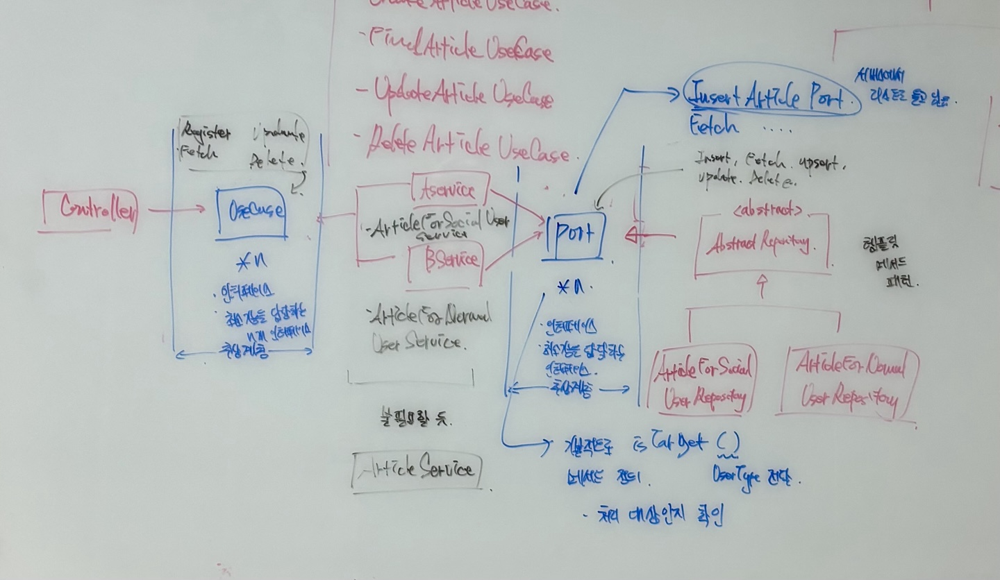

# 디자인 패턴 적용 과정 

<br>

### 디자인 패턴

<a href="https://www.youtube.com/watch?v=CtmNBKivFKY" target="_blank">
    
</a>

> - 디자인 패턴이란? OOP 설계를 돕는 특정 방식이다
> - 런타임 시점 이전에 코드를 어디에 배치해야 하며, 런타임 시점에는 어떻게 합성시킬지 고민해야한다.
> - 이는 결국 빈번히 발생하는 새로운 요구사항이나 변경사항에 대해 유리하게 대처함으로써 확장성이 뛰어나며 견고한 애플리케이션을 구축하기 위함이다. 
> - 위에 사진을 클릭하면 내가 예전에 설명한 디자인 패턴 부분으로 이동할 수 있다. 

<br>

### 디자인 패턴 적용과정
### 1. 사용자의 구독 서비스 이용 가능을 검증하는 객체 -> 전략 패턴(Strategy)
> - 전략 패턴
>   - 변경 포인트가 높은 의존 객체를 인터페이스로 정의하여 외부로 분리하고 해당 인터페이스의 여러가지 구현체를 정의함으로써 런타임 시점에 필요에 따라 특정 구현체를 사용할 수 있게 구성하는 패턴이다.
>   - 포함 관계로서 인터페이스 구현(implements)으로 확장해 나간다.
> - 현재 서비스에서 정의된 구독권의 경우 크게 5가지가 있다
>   - 1. FREE
>   - 2. BRONZE
>   - 3. SILVER
>   - 4. GOLD
>   - 5. PLATINUM
> - 아래로 내려올 수록 혜택 내용이 좋다. 예를 들어서, 구독자 전용 게시글을 더 많이 볼 수 있거나 다운로드 받을 수 있다.
> - 하지만, 해당 부분은 변경의 여지가 높다. 서비스 운영과정에서 특정 구독권을 폐지하거나 추가할 수 있다.
> - 따라서, 앞으로 일어날 변경사항에 적절히 대처해야한다.
> - 사용자가 구독자 전용 서비스를 이용할 때 마다 해당 서비스를 이용할 수 있는지 검증 객체를 활용한다.
> - 하지만, 하나의 객체를 사용하는 것이 아니라 각 구독권에 맞는 검증 객체를 정의하며 해당 객체들은 같은 인테페이스를 구현하도록 구성했다.
> - 이는 앞으로 일어날 변경 사항에 적절히 대처하기 위함이다.
> - 서비스 객체가 검증 객체를 통해 특정 유저의 구독 서비스 이용 가능 여부를 확인하며 이에 따라 달리 비즈니스를 처리해야한다. 
> - 이러한 이유로 해당 서비스 객체는 검증 객체를 상위 인터페이스 타입으로 빈을 주입받아서 List 형태로 검증 객체를 관리하게끔 구성했다. 

<br>

### 2. 사용자의 유형에 따라 달리 처리해야하는 객체 -> 템플릿 메서드 패턴(Template Method)? 전략 패턴(Strategy)!

> - <strong>현재 서비스의 RDB에서 회원의 경우, 여러 유형별로 나뉨. 일반 회원, 소셜 회원, 공인 회원, 관리자로 나뉨
> - 그렇기 때문에 개발 초기에 코드를 보면 when이나 if 절을 사용해서 비즈니스 로직 흐름을 결정지음
> - 위 방식은 변경사항에 유리하게 대처하기 어려운 구조임, 예를 들어 또 다른 유형의 회원이 등장하면 또 if 절이나 when 절을 작성해야함
> - 이를 해소하기 위해선 의존 오브젝트 사이에 추상계층을 둠으로써 확장할 수 있게 구성해야함 </strong>

```KOTLIN
    fun create(userId: String, articleCreateCommand: ArticleCreateCommand): ArticleCreateResponse {
        val sodamUser = socialUserRepository.findBySocialUserId(userId)
            .orElseGet {
                userRepository.findUserByUserId(userId)
                    .orElseThrow { UserException.UserNotFoundException() }
            }

        // 해당 부분은 변경에 취약함. 
        // 미래에 또다른 회원 유형이 정의되면 그에 따라 when에 또다른 코드를 작성해야함
        // => 따라서, Repository와 Service 사이에 추상계층을 둠으로써 확장성이 용이하게 코드를 작성해야함   
        val sodamArticle = when (sodamUser.userType) {
            UserType.SOCIAL -> {
                articleRepository.createArticleForSocialUser(
                    userId,
                    articleCreateCommand
                )
            }
            else -> {
                articleRepository.createArticleForUser(
                    userId,
                    articleCreateCommand
                )
            }
        }

        return ArticleCreateResponse(
            articleId = sodamArticle.articleId,
            title = articleCreateCommand.title,
            author = sodamArticle.author,
            summary = sodamArticle.summary,
            content = sodamArticle.content,
            tags = sodamArticle.tags,
            createdAt = sodamArticle.createdAt
        )
    }
```

(위 그림에서는 각 계층별로 추상계층을 바라보게 만들고 그 밑에 구현계층을 둠으로써 개발하려는 의도임)

> - 초기 접근법에서는 '템플릿 메서드 패턴'을 적용하려고 함 
> - <strong>하지만, ISP 원칙을 바탕으로 의존 대상을 여러 작은 형태의 인터페이스로 구현하게 만들었기 때문에 '전략 패턴'이 더 자연스러움
> - 또한, '템플릿 메서드 패턴'의 경우 '상속'으로서 코드를 확장해 나가기 때문에 '전략 패턴'에 비해 확장성이 떨어짐</strong>
> - 여기서, SodamUser는 현재 자신의 회원 유형을 Enum으로 가지고 있음
> - 이를 바탕으로 각 인터페이스에는 isTarget() 이라는 메서드를 정의해서 해당 유형의 유저가 처리할 수 있는 대상인지 식별할 수 있게 만들어야함(서비스에서는 해당 빈을 리스트 형태로 가지고 있음)
> - <strong>물론, 모든 인터페이스가 isTarget()을 구현하는 것은 비효율적이기에 이 부분에는 추상 클래스로 선언해서 적용해도 괜찮을 것 같음</strong> 
> - 아마 밑에와 같은 형태로 코드를 구성하게 될 것임
```JAVA
    // 예전에 넷플릭스 구독권 서비스 개발 과정에서 구현한 전략패턴 
    // 해당 서비스는 validator 객체를 list로 가지고 있음 
    @Override
    public String download(String userId, String role, String movieId) {
        long cnt = downloadMoviePort.downloadCntToday(userId);

        // 유저가 영화를 다운로드 받을 수 있는지 확인하는 로직 
        // 유저는 특정 구독권을 가지고 있음 
        boolean validate = validators.stream()
                .filter(validator -> validator.isTarget(role)) // 적용 대상인지 확인 
                .findFirst()
                .orElseThrow()
                .validate(cnt);

        if (!validate) {
            throw new RuntimeException("더 이상 다운로드 할 수 없습니다.");
        }

        YeonuelixMovie by = persistenceMoviePort.findBy(movieId);
        downloadMoviePort.save(UserMovieDownload.newDownload(userId, movieId));

        return by.getMovieName();
    }

```


