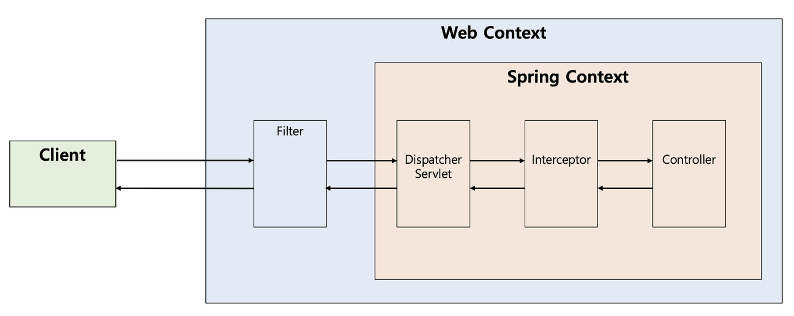

# 인터셉터와 필터

### 필터란?



> - 필터는 J2EE 표준 스펙 기능으로 디스패처 서블릿에 요청이 전달되기 전/후에 url 패턴에 맞는 모든 요청에 대해 부가작업을 처리할 수 있는 기능을 제공함
> - 예를 들어서, 해당 프로젝트에서는 사용자의 요청 이력을 처리하기 위해서 UserHistoryLoggingFilter를 정의해서 사용했다. 이렇게 적용하면 사용자가 어떤 요청을 보냈는지 추적하기 용이하다
> - 필터는 스프링 컨테이너가 아닌 톰캣과 같은 웹 컨테이너(서블릿 컨테이너)에 의해 관리된다.(물론, 스프링 빈으로 등록도 가능하다.)
> - 그래서 디스패처 서블릿 전/후에 무언가 작업을 처리하기 좋다
> - 그래서, 스프링 시큐리티도 필터에서 사용자 요청을 가로채서 인증, 권한을 처리한다


<br>

### 필터의 메서드
> - 필터를 추가하기 위해선 javax.servlet의 Filter 인터페이스를 구현해야하며 해당 인터페이스는 3가지 메서드를 정의하고 있다
>   - (1) init()
>   - (2) doFilter()
>   - (3) destroy()
> - (1) init() 
>   - 해당 메서드는 필터 객체를 초기화하고 서비스에 추가하기 위한 메서드
>   - 웹 컨테이너가 1회 init()을 호출하여 필터 객체를 초기화하면 이후의 요청들은 doFilter()를 통해 처리됨
> - (2) doFilter()
>   - url-pattern에 맞는 모든 HTTP 요청이 디스패처 서블릿으로 전달되기 전에 웹 컨테이너에 의해 실행되는 메서드임
>   - doFilter()의 파라미터로는 FilterChain이 있는데, FilterChain의 doFilter를 통해 다음 대상으로 요청을 전달하게 됨
>   - chain.doFilter() 전/후에 필요한 처리 과정을 넣어줌으로써 원하는 처리를 진행할 수 있음
> - (3) destory() 
>   - 해당 메서드는 필터 객체를 서비스에서 제거하고 사용하는 자원을 반환하기 위한 메서드임
>   - 이는 웹 컨테이너에 의해 1번 호출되며 이후에는 doFilter에 의해 처리되지 않음 

<br>
<br>

### 인터셉터란?


> - 인터셉터는 Spring이 제공하는 기술로써, 디스패처 서브릿이 컨트롤러를 호출하기 전과 후에 요청과 응답을 참조하거나 가공할 수 있는 기능을 제공함
> - 즉, 인터셉터는 스프링 컨텍스트에서 동작함
>    - 해당 프로젝트에서는 인터셉터를 시스템 칼럼 데이터를 추가할 때 사용했다
>   - 클라이언트로부터 요청이 전달되면 헤더로부터 요청자가 누구인지 조회해서 데이터를 넣어줬다 
> - 디스패처 서블릿은 핸들러 매핑을 통해 적절한 컨트롤러를 찾도록 요청하는데, 그 결과로 실행 체인을 돌려줌
> - 그래서 이 실행 체인은 1개 이상의 인터셉터가 등록되어 있다면 순차적으로 인터셉터를 거쳐 컨트롤러가 실행되도록 하고, 인터셉터가 없다면 바로 컨트롤러를  실행하는 구조임
> - 인터셉터는 스프링 컨테이너 내에서 동작하므로 필터를 거쳐 프론트 컨트롤러인 디스패처 서블릿이 요청을 받은 이후에 동작하게 됨(위 그림에서 주의할 점은 인터셉터가 컨트롤러에 요청을 위임하지 않는다는 점임)

<br>

### 인터셉터의 메서드
> - 인터셉터를 추가하기 위해선 org.springframework.web.servlet의 HandlerHandlerInterceptor 인터페이스를 구현해야함
> - 해당 인터페이스는 3개의 메서드를 가지고 있음
>   - (1) preHnadle()
>   - (2) postHandle()
>   - (3) afterCompletion()
> - (1) preHandle()
>   - 해당 메서드는 컨트롤러가 호출되기 전에 실행됨
>   - 그래서, 컨트롤러 이전에 처리해야 하는 전처리 작업이나 요청 정보를 가공하거나 추가하는 경우에 사용할 수 있음
>   - preHandle의 3번째 파라미터인 handler 파라미터는 핸들러 매핑이 찾아준 컨트롤러 빈에 매핑되는 HandlerMethod라는 새로운 타입의 객체로써, @RequestMapping이 붙은 메서드의 정보를 추상화한 객체임
>   - 또한, preHandle의 반환 타입은 boolean 인데 반환값이 true이면 다음 단계로 진행되지만, false라면 작업을 중단하여 이후의 작업(다음 인터셉터, 컨트롤러)는 진행되지 않음 
> - (2) postHandle()
>   - 해당 메서드는 컨트롤러를 호출된 후에 실행됨
>   - 그래서, 컨트롤러 이후에 처리해야 하는 후처리 작업이 있을 때 사용함
>   - 해당 메서드에는 컨트롤러가 반환하는 ModelAndView 타입의 정보가 제공되는데, 최근에는 Json 형태로 데이터를 제공하는 RestAPI 기반의 컨트롤러 @RestController를 만들면서 자주 사용되지 않음
>   - 또한, 컨트롤러 하위 계층에서 작업을 진행하다가 중가넹 예외가 발생하면 postHandle은 호출되지 않음
> - (3) afterCompletion()
>   - 해당 메서드는 이름 그래도 모든 뷰에서 최종 결과를 생성하는 일을 포함해 모든 작업이 완료된 이후에 실행됨
>   - 요청 처리 중에 사용한 리소스를 반환할 때 사용하기에 적합함
>   - postHandle과 달리 컨트롤러 하위 계층에서 작업을 진행하다가 중간에 예외가 발생하더라도 afterCompletion은 반드시 호출됨 

<br>
<br>

### 필터 vs 인터셉터 차이 및 용도


> - 위에서 필터와 인터셉터의 배치 구조를  보면, 서로 다른 영역에서 관리되는 것을 확인할 수 있음
> - 필터는 스프링 이전의 서블릿 영역에서 관리되지만, 인터셉터는 스프링 영역에서 관리되는 영역이기 때문에 필터는 스프링이 처리해주는 내용들을 적용받을 수 없음
> - 이러한 차이로 발생하는 대표 예시는 스프링에 의한 예외처리가 되지 않는다는 것

<br>

### 스프링의 예외 처리 여부


```java
// 1. 스프링에서 주로 예외 처리하는 형태 
@RestControllerAdvice
public class GlobalExceptionHandler extends ResponseEntityExceptionHandler {


    @ExceptionHandler(MemberNotFoundException.class)
    public ResponseEntity<Object> handleMyException(MemberNotFoundException e) {
        return ResponseEntity.notFound()
            .build();
    }
    
    ...
}


// 2. 필터에서 예외 처리를 하게되는 경우 
public class MyFilter implements Filter {

    @Override
    public void doFilter(ServletRequest request, ServletResponse response, FilterChain chain) throws IOException, ServletException {
        HttpServletResponse servletResponse = (HttpServletResponse) response;
        servletResponse.setStatus(HttpServletResponse.SC_NOT_FOUND);
        servletResponse.getWriter().print("Member Not Found");
    }
}

```

> - 스프링을 사용하면 주로 ControllerAdvice와 ExceptionHandler를 이용한 예외처리 기능을 주로 사용함
> - 예를 들어서, 아래 로직을 보면 특정 회원을 찾지 못하여 MemberNotFoundException 예외를 던졌다면 404 Status로 응답을 반환하기 원하며 이를 위해 다음과 같은 예외 처리기를 구현함
> - 이를 통해 예외가 서블릿까지 전달되지 않음
> - 하지만, 필터의 경우 스프링 앞의 서블릿 영역에서 관리되기 때문에 스프링의 지원을 받을 수 없음
> - 그래서 만약 필터에서 MemberNotFoundException을 던지면, 에러가 처리되지 않고 서블릿까지 전달됨
> - 서블릿은 예외가 핸들링 되기를 기대했지만, 예외가 그대로 올라와서 예상치 못한 Exception을 만난 상황임.
> - 따라서, 내부에 문제가 잇다고 판단하여 500 Status로 응답을 반환함
> - 이를 해결하려면 필터에서 응답 객체에 예외 처리가 필요함

<br>

### Request/Response 객체 조작 가능 여부

```java
public MyFilter implements Filter {

    public void doFilter(ServletRequest request, ServletResponse response, FilterChain chain) {
        // 개발자가 다른 request와 response를 넣어줄 수 있음
        chain.doFilter(new MockHttpServletRequest(), new MockHttpServletResponse());       
    }
    
}
```

> - 필터는 Request와 Response를 조작할 수 있지만, 인터셉터는 조작할 수 없음
> - 여기서 조작한다는 것은 내부 상태를 변경하는 것이 아니라 다른 객체로 대체한다는 것임
> - 이는 필터와 인터셉터의 코드를 보면 알 수 있음
> - 필터가 다음 필터를 호출하기 위해서는 필터 체이니(다음 필터 호출)을 해주어야함
> - 그리고 이때, Request/Response 객체를 넘겨주므로 우리가 원하는 Request/Response 객체를 넣어줄 수 있음
> - 하지만, 인터셉터는 처리 과정이 필터와 다름
> - 디스패처 서블릿이 여러 인터셉터 목록을 가지고 있고 for 문으로 순차적으로 실행시킴
> - 그리고 true를 반환하여 다음 인터셉터가 실행되거나 컨트롤러 요청이 전달되며 false가 반환되면 요청이 중단됨
> - 그러므로, 우리가 다른 Request/Response 객체를 넘겨줄 수 없음
> - 그리고 이러한 부분이 필터와 확실히 다른 점임

 
### 필터와 인터셉터의 용도 및 예시
### 1. 필터의 용도 및 예시 
> - 필터의 용도 및 예시는 아래와 같음
>   - 1. 공통된 보안 및 인증/인가 관련 작업
>   - 2. 모든 요청에 대한 로깅 또는 감사
>   - 3. 이미지/데이터 압축 및 문자열 인코딩
>   - 4. Spring과 분리되어야 하는 기능
> - 필터에서는 기본적으로 스프링과 무관하게 전역적으로 처리해야 하는 작업들을 처리할 수 있음
> - 대표적으로 보안 공통 작업이 있음
> - 필터는 인터셉터보다 앞에 배치되어 동작하므로 전역적으로 해야하는 보안 검사(XSS 방어 등)를 올바른 요청이 아닐 경우 차단할 수 있음
> - 그러면 스프링 컨테이너까지 요청이 전달되지 못하고 차단되므로 안정성을 더욱 높일 수 있음
> - 또한, 필터는 이미지나 데이터의 압축이나 문자열 인코딩과 같이 웹 애플리케이션에 전반적으로 사용되는 기능을 구현하기에 적당함
> - Filter는 다음 체인으로 넘기는 ServletRequest/ServletResponse 객체를 조작할 수 있다는 점에서 Interceptor보다 훨씬 강력한 기술임

<br>

### 2. 인터셉터의 용도 및 예시
> - 인터셉터의 용도 및 예시는 아래와 같음
>   - 1. 세부적인 보안 및 인증/인가 공통 작업
>   - 2. API 호출에 대한 로깅 또는 감사
>   - 3. Controller로 넘겨주는 정보(데이터)의 가공
> - 인터셉터에서는 클라이언트의 요청과 관련되어 전역적으로 처리해야 하는 작업들을 처리할 수 있음
> - 대표적으로 세부적으로 적용해야 하는 인증이나 인가와 같이 클라이언트 요청과 관련된 작업 등이 있음
> - 예를 들어, 특정 그룹의 사용자는 어떤 기능을 사용하지 못하는 경우가 있는데, 이러한 작업들은 컨트롤러로 넘어가기 전에 검사해야 하므로 인터셉터가 처리하기에 적합함
> - 또한, 인터셉터는 필터와 다르게 HttpServletRequest나 HttpServletResponse 등과 같은 객체를 제공받으므로 객체 자체를 조작할 수는 없음. 대신 해당 객체가 내부적으로 갖는 값은 조작할 수 있으므로 컨트롤러로 넘겨주기 위한 정보를 가공하기에 용이함
> - 예를 들어, 사용자의 ID를 기반으로 조회한 사용자 정보를 HttpServletRequest에 넣어줄 수 있음
> - 그 외에도 우리는 다양한 목적으로 API 호출에 대한 정보들을 기록해야 할 수 있음
> - 이러한 경우에 HttpServletRequest나 HttpServletResponse를 제공해주는 인터셉터는 클라이언트의 IP나 요청 정보들을 포함해 기록하기에 용이함

<br>

### 마무리
> - 대표적으로 필터를 인증과 인가에 사용하는 도구로는 SpringSecurity가 있음
> - SpringSecurity의 특징 중 하나는 Spring MVC에 종속적이지 않다는 것임
> - 이러한 이유로는 필터 기반으로 인증/인가 처리를 하기 때문임

<br>

### 레퍼런스
> - https://mangkyu.tistory.com/173


