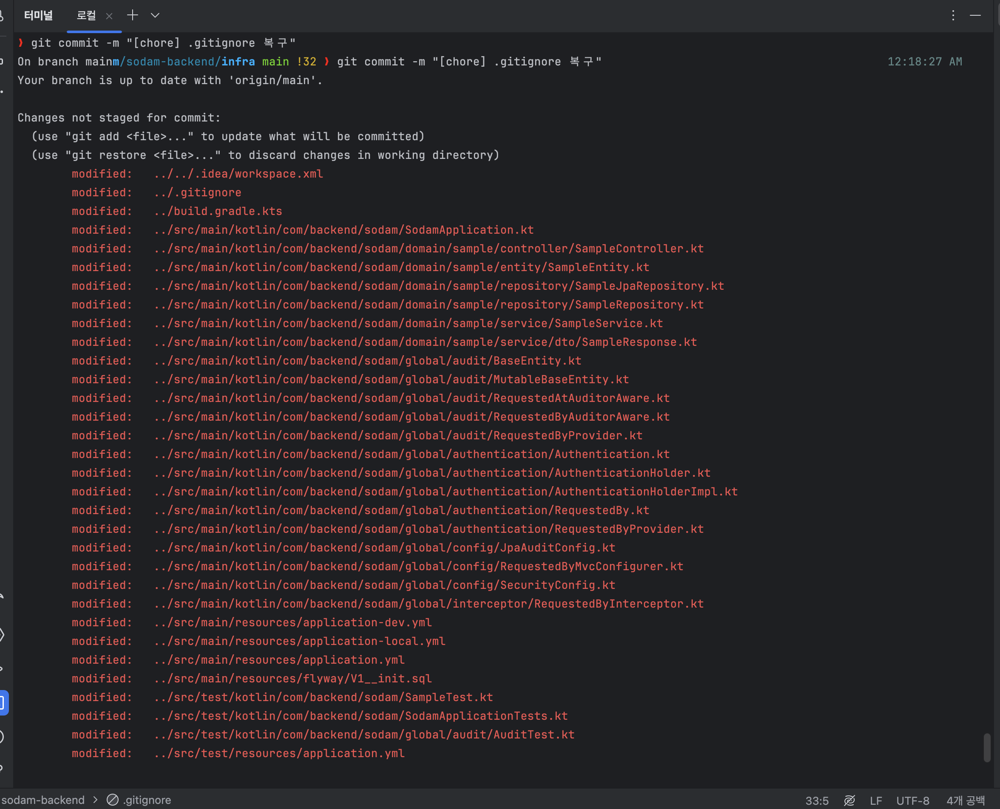

# 📌 브랜치 체크아웃 중 기존에 작업한 파일이 없어지는 문제

## 문제 정의 => '백엔드 설정 브랜치'에서 'main' 브랜치로 체크아웃 하는 과정에서 '백엔드 설정 브랜치' 작업이 날라감

> - 백엔드 설정 관련 처리 브랜치에서 작업을 마무리하고 main 브랜치로 체크아웃하는 과정에서 기존에 작업한 파일들이 다 없어짐

## 해결

> - 변경 사항을 복원해야함
> - 인텔리제이에서 마우스 우클릭을 하여 '로컬 기록(Local History | Show History)'를 선택하고 복원하려는 코드를 찾아서 넣어주면됨
> - 참고자료 : https://blog.jetbrains.com/ko/2020/03/26/local-history-intellij-save-your-code-ko/
