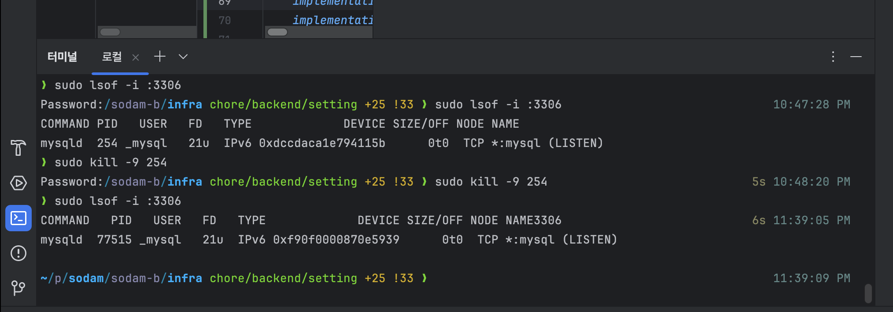
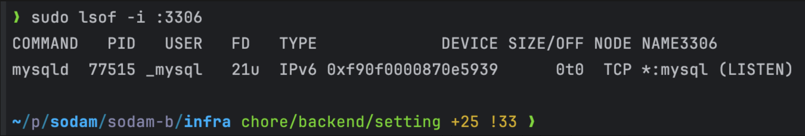

# 📌 도커 실행시 3306 포트 점유 문제

## 문제 정의 => 3306 포트를 자동으로 점유하는 MySQL




```
Error response from daemon: Ports are not available: exposing port TCP 0.0.0.0:3306 -> 0.0.0.0:0: listen tcp 0.0.0.0:3306: bind: Only one usage of each socket address (protocol/networ
k address/port) is normally permitted.
```
> - 도커로 mysql 이미지를 띄웠으나 3306 포트를 이미 사용 중이여서 도커를 실행할 수 없음
> - sudo lsof -i :3306 로 3306을 점유한 프로세스를 확인하고 sudo kill -9 <PID> 로 해당 프로세스를 종류했으나 계속해서 3306 포트를 점유하는 프로세스가 나타남 

## 해결책 
> - MySQL 서버가 자동으로 재시작되는 설정이 되어 있기 때문에 sudo kill -9 <PID>를 해도 계속해서 mysql 서버가 3306 포트를 재점유함
> - sudo pkill mysqld으로 MySQL 프로세스 수동으로 종료할 수 있음 
